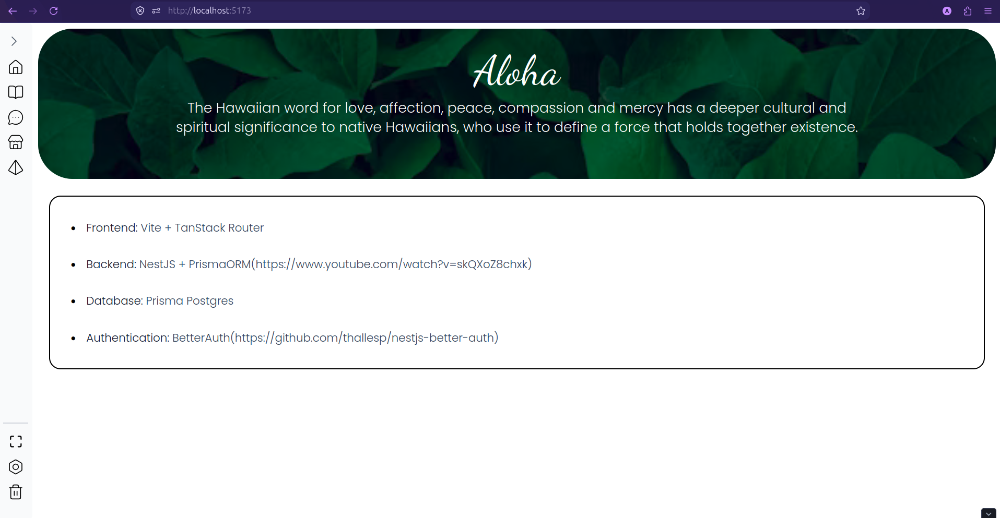
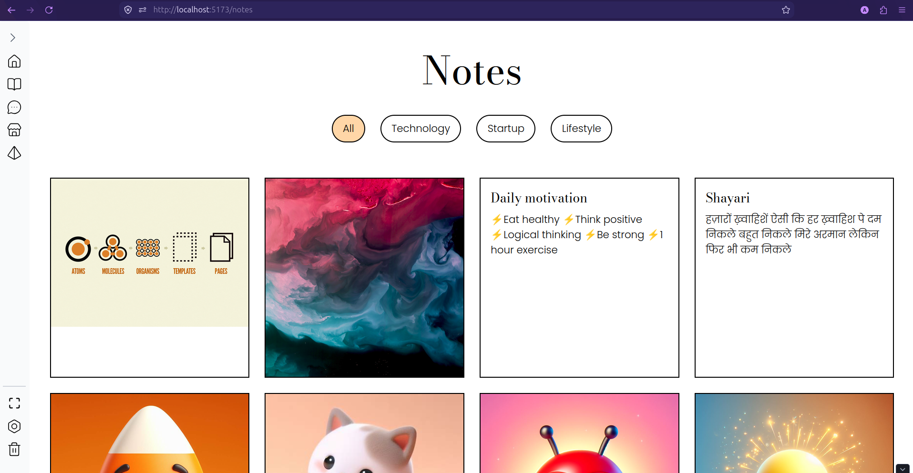
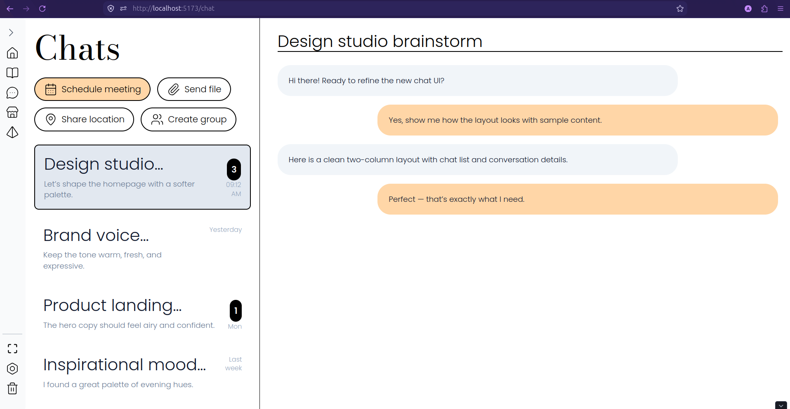
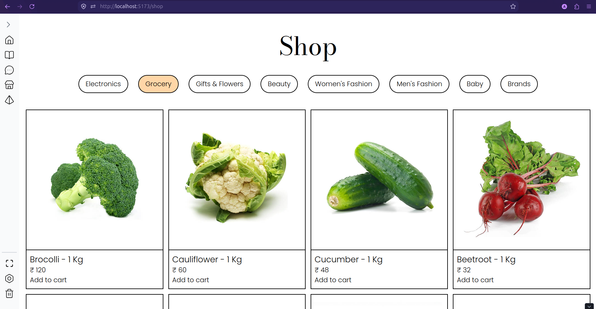

## Architecture

- **Aloha** (backend)
	- NestJS application with PrismaORM and PostgresDB
	- Authentication via `better-auth` + `@thallesp/nestjs-better-auth`
	- `.env` loaded via `@nestjs/config`
		- DATABASE_URL=?
		- BETTER_AUTH_SECRET=?
		- BETTER_AUTH_URL=http://localhost:3000
		- BACKEND_PORT=3000
		- FRONTEND_PORT=5173

- **Belle** (frontend)
	- Vite + React (TSX) app in `belle/`
	- `.env` uses `VITE_` prefixed variables
		- VITE_FRONTEND_PORT=5173
		- VITE_BACKEND_PORT=3000


## Run the project

Start backend (from repo root):

```bash
cd aloha && npm run start:dev
```

Start frontend:

```bash
cd belle && npm run dev
```

After starting both, open the frontend (default): `http://localhost:5173`.

## Screenshots

Below are a few UI screenshots from the Belle frontend.

### Home


### Notes


### Chat


### Shop


