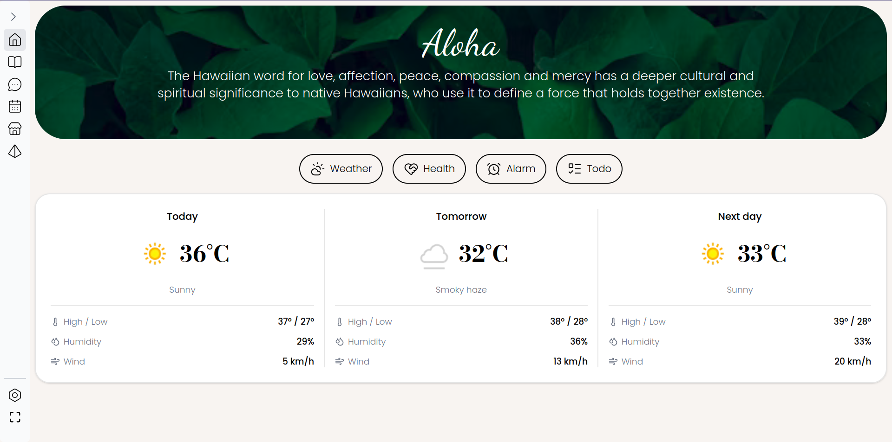
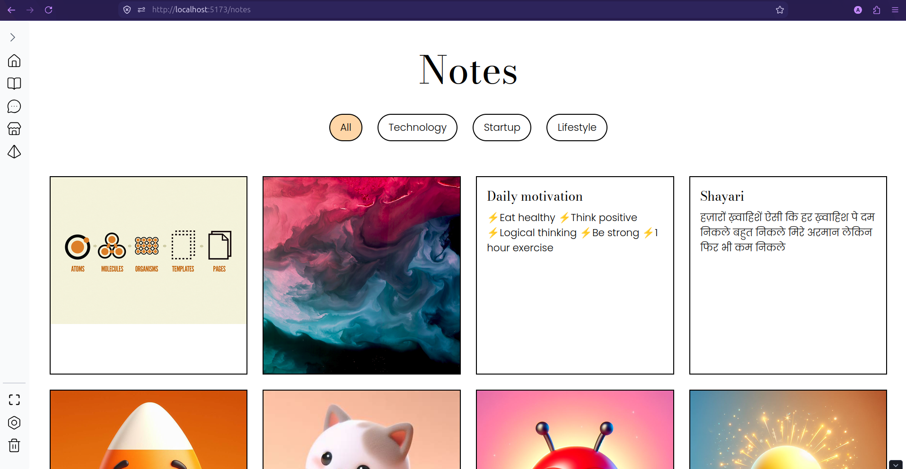
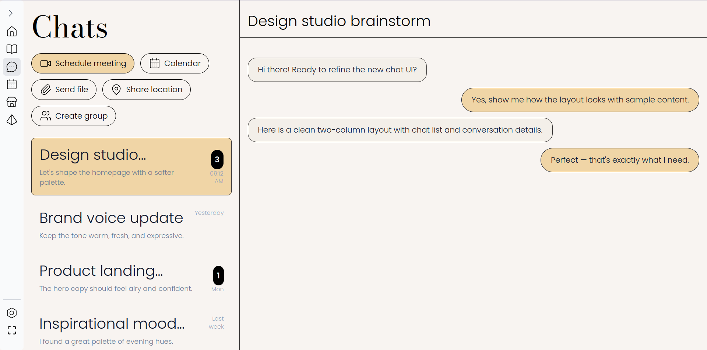
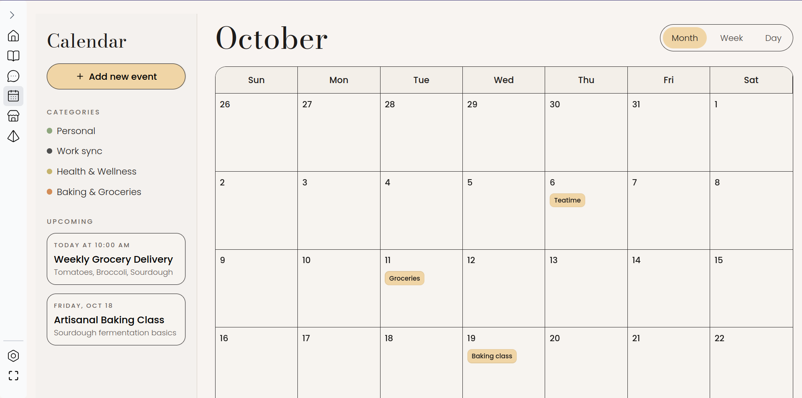
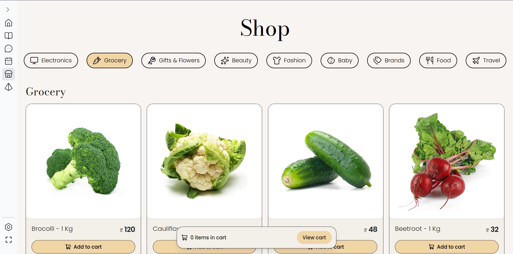
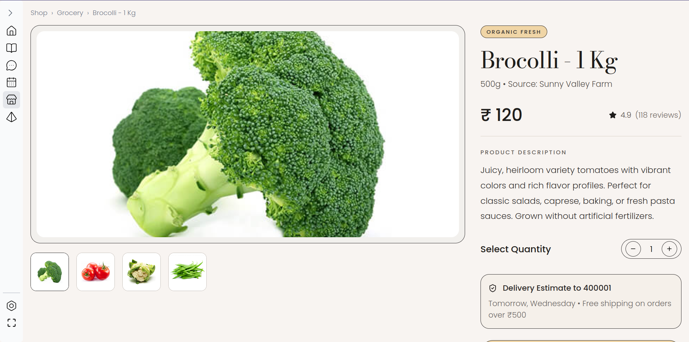
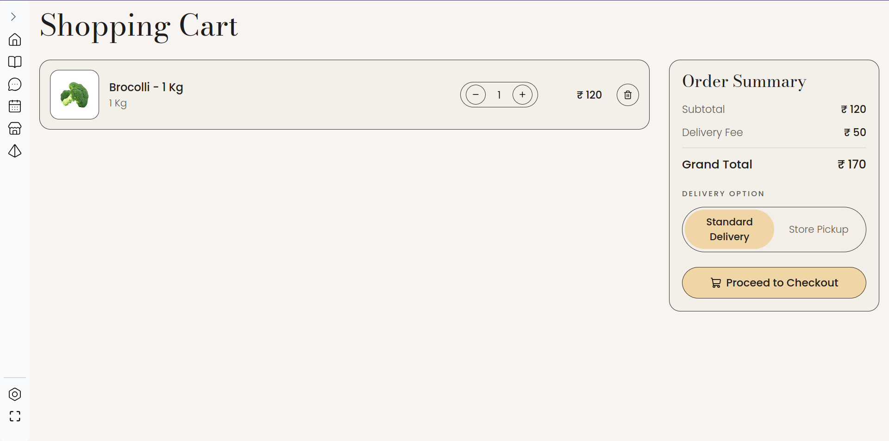
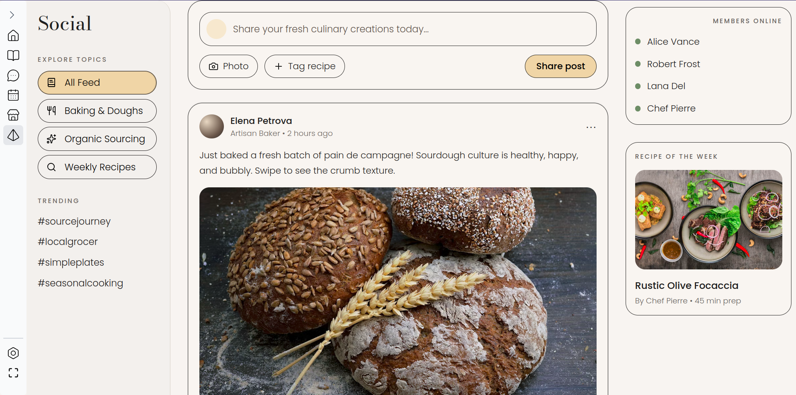

## Architecture

- **Aloha** (backend)
	- NestJS application with PrismaORM and PostgresDB
	- Authentication via `better-auth` + `@thallesp/nestjs-better-auth`
	- `.env` loaded via `@nestjs/config`
		- DATABASE_URL=?
		- BETTER_AUTH_SECRET=?
		- BETTER_AUTH_URL=http://localhost:3000
		- BACKEND_PORT=3000
		- FRONTEND_PORT=5173

- **Belle** (frontend)
	- Vite + React (TSX) app in `belle/`
	- `.env` uses `VITE_` prefixed variables
		- VITE_FRONTEND_PORT=5173
		- VITE_BACKEND_PORT=3000

- **Milo** (mobile)
	- Flutter framework

## TODO

- Darkmode
- Notes update functionality
- ✅Why authenticated user can see the login register routes
- Update backend dependency
- Integrate milo
- Prisma upgrade
- Authentication and Authorization. 
- Admin can control the user visible mini-apps. 
- ✅Email OTP login. 
- Replace screenshot with figma url
- Adaptive widgets

https://medium.com/@balajibal/super-apps-the-operating-system-of-everyday-life-38706471a94b
https://github.com/itsmbaqer/mini-programs-guidelines
 

## Run the project

Start frontend & backend (from repo root):

```bash
pnpm web
```

Start mobile:

```bash
adb connect <ip> && flutter run
```

## Screenshots

Below are a few UI screenshots from the Belle frontend.

### Home


### Notes


### Chat


### Calendar


### Shop






### Social

